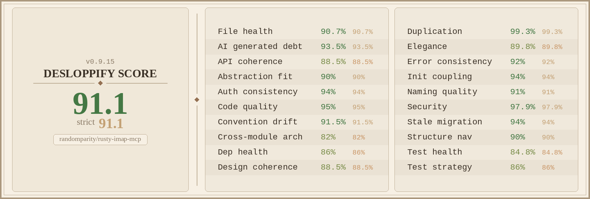

# rusty-imap-mcp

[](https://github.com/randomparity/rusty-imap-mcp/actions/workflows/ci.yml)
[](https://github.com/randomparity/rusty-imap-mcp/releases)
[](LICENSE-MIT)
[](rust-toolchain.toml)

A security-first [Model Context Protocol](https://modelcontextprotocol.io/)
server for IMAP email, written in Rust.

## Why this exists

LLM agents with email access are targets for prompt injection. A single
crafted message can contain hidden instructions that cause an agent to
send mail, leak data, or pivot to other tools. Most MCP email servers
pass raw message content straight to the model.

rusty-imap-mcp treats every byte of email content as untrusted input.
Messages are parsed, sanitized, normalized, and structurally tagged
before reaching the agent — so the model sees clean content with
security metadata, not raw attack surface.

## Features

### Content defense

- HTML sanitization with hidden-element stripping (CSS `display:none`,
  `visibility:hidden`, `opacity:0`, white-on-white text)
- Unicode NFKC normalization and invisible character stripping
  (zero-width, bidi overrides, C0/C1 controls)
- Look-alike detection: mixed-script domains, confusable skeletons,
  display-name spoofing, reply-to mismatch, filename bidi tricks
- Structured response envelope separating trusted `meta` from
  `untrusted` content and `security_warnings`
- Mailing list detection and content provenance tagging

### Authorization

- Four security postures: `readonly`, `draft-safe` (default), `full`,
  `destructive`
- Per-tool `"allow"` / `"deny"` overrides
- Denied tools hidden from `list_tools` and rejected at dispatch
- `$PendingReview` flag on drafts — human-in-the-loop gate

### Audit and limits

- Append-only JSONL audit log with tamper detection
- Token-bucket rate limiting (per-tool, per-account)
- Circuit breaker with sliding-window error counting
- TLS certificate fingerprint pinning

### Email operations

- 22 posture-gated tools: list, search, fetch, flag, label, move,
  draft, send, folder management, attachment download
- 2 infrastructure tools: `list_accounts`, `use_account`
- Multi-account support with per-account posture, rate limits, and
  circuit breaker
- SMTP sending with automatic Sent-folder copy via IMAP APPEND

### Operations

- Single static binary — no runtime dependencies
- Pre-built binaries for 5 platforms (x86_64/aarch64 Linux, aarch64
  macOS, ppc64le, s390x)
- TOML configuration with strict validation
- OS keychain credential storage (no passwords in config files)
- `--dry-run` mode for connection testing

## How it compares

| Feature | rusty-imap-mcp | [mcp-email-server](https://github.com/ai-zerolab/mcp-email-server) | [email-mcp](https://github.com/codefuturist/email-mcp) | [read-no-evil-mcp](https://github.com/thekie/read-no-evil-mcp) |
|---------|:-:|:-:|:-:|:-:|
| **Security** | | | | |
| Content sanitization | yes | no | no | no |
| Prompt injection defense | structural | no | no | ML (72% detection) |
| Unicode normalization | yes | no | no | no |
| Invisible char stripping | yes | no | no | partial |
| Look-alike detection | yes | no | no | no |
| Security postures | 4 tiers + per-tool | no | no | per-account perms |
| Audit log | append-only JSONL | no | audit trail | no |
| TLS fingerprint pinning | yes | no | no | no |
| Rate limiting | token-bucket | no | token-bucket | no |
| Circuit breaker | yes | no | no | no |
| **Capabilities** | | | | |
| Tool count | 24 | ~10 | 47 | 7 |
| Multi-account | yes | yes | yes | yes |
| SMTP send | yes | yes | yes | yes |
| Credential storage | OS keychain | env vars | config file | env vars |
| IMAP IDLE / watcher | no | no | yes | no |
| Email scheduling | no | no | yes | no |
| **Runtime** | | | | |
| Language | Rust | Python | TypeScript | Python |
| Install | single binary | `pip` / `uvx` | `npx` / `pnpm` | `pip` + PyTorch (~500 MB) |
| Docker | no | yes | yes | yes |

Based on public documentation as of April 2026. Corrections welcome
via issue or PR.

## Get started

Pick your email provider:

- **[Quick start: Gmail](docs/quickstart-gmail.md)** — ~10 minutes,
  requires an App Password
- **[Quick start: Proton Bridge](docs/quickstart-proton-bridge.md)** —
  ~15 minutes, includes TLS fingerprint setup

For other IMAP servers (Fastmail, Dovecot, Cyrus, etc.), follow the
Gmail guide and adjust the `host`, `port`, and `encryption` fields for
your provider.

## MCP tools

**22 posture-gated tools:**

- **Read:** `list_folders`, `search`, `search_advanced`,
  `fetch_message`, `fetch_message_html`, `list_attachments`,
  `download_attachment`, `list_labels`
- **Mutate:** `mark_read`, `mark_unread`, `flag`, `unflag`,
  `add_label`, `remove_label`, `move_message`, `create_draft`
- **Manage:** `send_email`, `delete_message`, `create_folder`,
  `rename_folder`, `expunge`, `delete_folder`

**2 infrastructure tools** (always available):
`use_account`, `list_accounts`

See [docs/postures.md](docs/postures.md) for the full 22-tool x
4-posture matrix.

## Build from source

```bash
git clone https://github.com/randomparity/rusty-imap-mcp.git
cd rusty-imap-mcp
cargo build --release
```

Requires Rust 1.88.0+ and `libdbus-1-dev` (Linux) or equivalent.

### Development

```bash
just setup    # install required tooling and pre-commit hooks
just ci       # run the full local-CI equivalent
```

## Pre-built binaries

Binaries are published for five targets on each
[release](https://github.com/randomparity/rusty-imap-mcp/releases):
`x86_64-unknown-linux-gnu`, `aarch64-unknown-linux-gnu`,
`aarch64-apple-darwin`, `powerpc64le-unknown-linux-gnu`,
`s390x-unknown-linux-gnu`. SHA256 checksums included.

## Documentation

- [Configuration reference](docs/configuration.md)
- [Security model and posture matrix](docs/security-model.md)
- [Multi-account support](docs/multi-account.md)
- [Audit log format](docs/audit-log.md)
- [Full documentation index](docs/INDEX.md)

## Troubleshooting

- **`rusty-imap-mcp` exits at startup with `audit file ... is already locked`** —
  another `rusty-imap-mcp` process holds the audit lock. Each MCP
  client must use a distinct `[audit].path`; see
  [Running multiple MCP clients](docs/audit-log.md#running-multiple-mcp-clients)
  for the configuration pattern.

## License

Dual-licensed under MIT OR Apache-2.0. See `LICENSE-MIT` and
`LICENSE-APACHE`.

## Security

See [`SECURITY.md`](SECURITY.md) for responsible disclosure and the
threat model summary.

## Code quality



Generated by [`desloppify`](https://github.com/peteromallet/desloppify)
against the current `main` branch. The 19 sub-scores cover file
health, API coherence, test strategy, security posture, dependency
hygiene, and more. Regenerate locally with `/desloppify` from Claude
Code.
